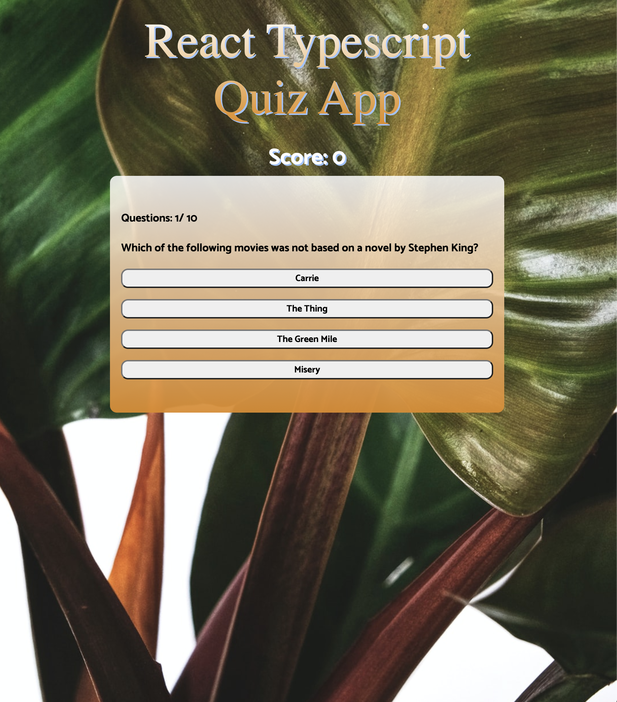

# **React Typescript Quiz App**

### Click the link to view the website

[React Typescript Quiz Webstite](https://react-typescript-quiz-app.netlify.app/)

### About Us

Simple Frontend application utilizing the [Open Trivia Database](https://opentdb.com/) API and [Styled-Components](https://styled-components.com/). The API generates Trivia questions and answers. That will pull a randomly generated background from Unsplash.

#### Project Work:

David Sheinbein - https://github.com/davesheinbein

#### LinkedIn:

David Sheinbein - https://www.linkedin.com/in/david-sheinbein/

## Screenshot:

[Sceenshot](https://imgur.com/h7YQPkP)

## Technologies Used:

#### 1. HTML5

#### 2. CSS

#### 3. JavaScript

#### 4. Typescript

#### 5. React

#### 6. Git

#### 7. Netlify

## Potential Next Steps:

### Click the link to view the website

[React Typescript Quiz Webstite](https://react-typescript-quiz-app.netlify.app/)

### Click the link to view David Sheinbeins Portfolio website

[David Sheinbein Portfolio Webstite](http://www.davidsheinbeinportfolio.com/)
